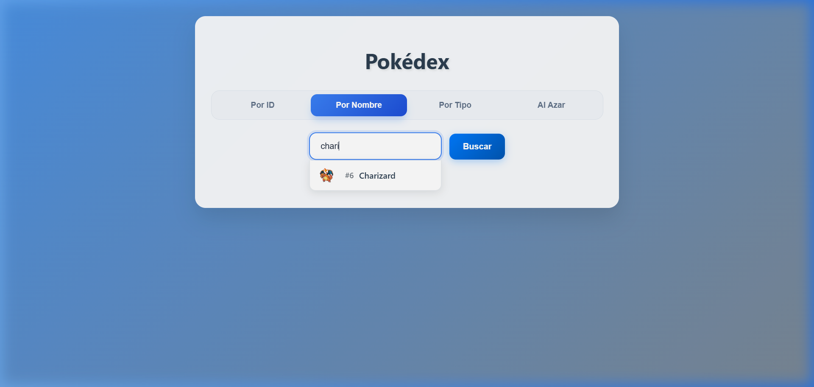
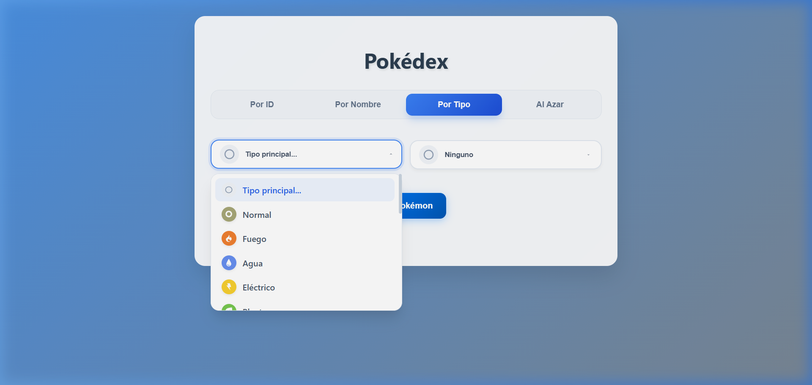
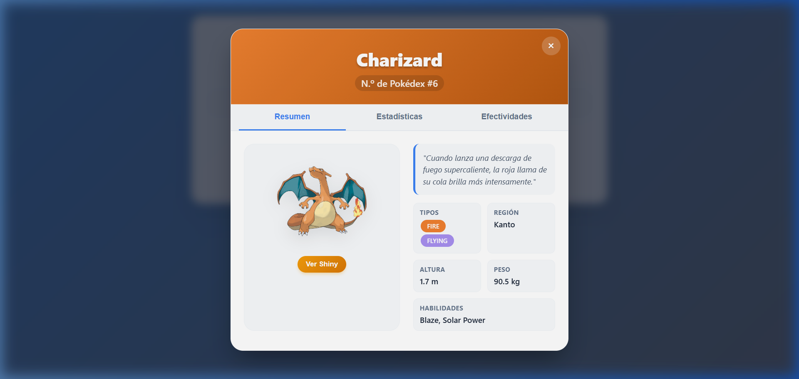
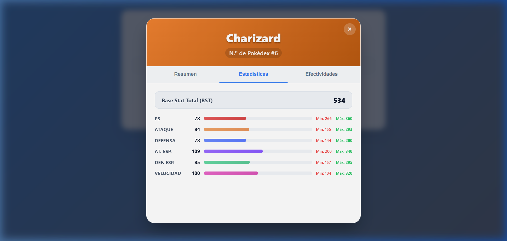
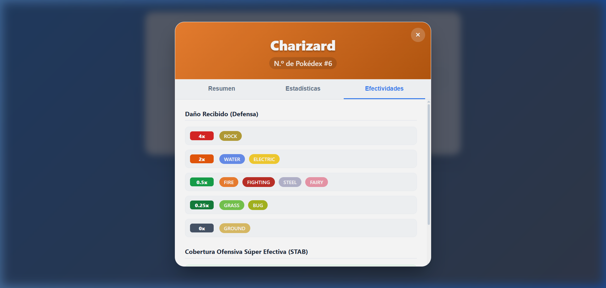

# Pokédex Web Profesional (Edición Competitiva)

Una aplicación web moderna, rápida y responsive diseñada para explorar el mundo Pokémon con un enfoque en herramientas de utilidad competitiva y una experiencia de usuario premium libre de emojis innecesarios.

---

## 📸 Vista Previa (Capturas de Pantalla)

### Interfaz Principal y Autocompletado de Nombres
La pantalla principal cuenta con pestañas alineadas y un sistema de autocompletado avanzado que muestra el número de la Pokédex y la miniatura (sprite) frontal de cada Pokémon en tiempo real.


### Selector de Tipos Inteligente y Pokéball Aleatoria
El filtro por tipo cuenta con desplegables personalizados que inyectan medallas circulares y los logotipos vectoriales oficiales (.svg) de cada tipo elemental. La sección de búsqueda al azar contiene una Pokéball CSS interactiva que gira con animación de captura.


### Modal de Detalles - Resumen (Normal y Shiny)
Al seleccionar un Pokémon se abre una modal premium estática que mantiene sus dimensiones fijas para evitar saltos. Permite visualizar el sprite oficial en alta definición e incluye un botón para alternar instantáneamente entre la versión normal y la versión shiny.


### Modal de Detalles - Estadísticas Competitivas a Nivel 100
Muestra un desglose completo de estadísticas base, suma del BST (Base Stat Total) y calcula automáticamente los rangos mínimos y máximos de cada stat que el Pokémon puede alcanzar a Nivel 100 en el ámbito competitivo.


### Modal de Detalles - Efectividades de Daño y STAB
Muestra una matriz defensiva que calcula el daño recibido (4x, 2x, 0.5x, 0.25x, 0x) considerando las combinaciones de doble tipo del Pokémon, además de indicar la cobertura ofensiva súper efectiva de sus ataques por STAB.


---

## ⚡ Características Principales

### 🔎 Módulos de Búsqueda Avanzados
*   **Búsqueda por ID**: Validación instantánea para números válidos del catálogo nacional (1-1010) con mensajes de error controlados.
*   **Búsqueda por Nombre con Autocompletado**: Entrada inteligente que filtra por prefijo, limitando a 8 sugerencias rápidas e inyectando una miniatura del Pokémon para una identificación visual rápida.
*   **Filtro por Tipo Dual Dinámico**: Selectores en formato de tarjetas personalizadas que cargan el logotipo oficial de cada elemento. Al elegir un tipo, el selector entero adopta su color y actualiza la medalla en tiempo real.
*   **Captura Aleatoria**: Una Pokéball diseñada con CSS que reacciona al cursor con animación de tambaleo y gira sobre su propio eje durante 750ms al ser pulsada antes de desplegar un Pokémon al azar.

### 📊 Detalle Técnico y Competitivo (Modal Premium)
*   **Estructura Flexbox Estática**: Dimensiones estáticas de la modal (`620px` de altura en escritorio, `85vh` en celulares) con barras de desplazamiento ultra delgadas de `6px` para una navegación suave y libre de brincos al cambiar de pestaña.
*   **Pestaña Resumen**: Carga en paralelo la descripción oficial en español del Pokémon desde el endpoint `/pokemon-species/`, su región de origen (Kanto, Johto, Hoenn, etc.), peso, altura y habilidades.
*   **Pestaña Estadísticas**: Gráficos de barras con colores asociados a cada stat. Calcula los valores mínimos (con naturaleza desfavorable y 0 IVs/EVs) y máximos (con naturaleza favorable, 31 IVs y 252 EVs) a Nivel 100.
*   **Pestaña Efectividades**: Cálculos defensivos matemáticos combinando multiplicadores elementales para doble tipo y lista ofensiva de tipos a los que golpea súper efectivo con bonus de STAB.

---

## 🛠️ Tecnologías y Recursos Utilizados

*   **HTML5 Semántico**: Estructura limpia y accesible de la Pokédex.
*   **CSS3 Nativo**: 
    *   Layouts fluidos basados en Flexbox y CSS Grid.
    *   Animaciones y transiciones de Pokéball y selectores.
    *   Scrollbars personalizados finos e invisibilidad controlada en layouts específicos.
*   **JavaScript Vanilla (ES6+)**:
    *   Peticiones asíncronas optimizadas con `fetch` y `Promise.all` para datos en paralelo.
    *   Control del DOM y manejo del autocompletado en tiempo real.
    *   Lógica y fórmulas para rangos de stats y compatibilidad de tipos.
*   **PokeAPI**: Consumo de datos RESTful de Pokémon.
*   **Logotipos Vectoriales de Tipo**: Iconografía SVG extraída del repositorio de vectores oficiales de Pokémon.

---

## 📂 Estructura del Proyecto

```
team_pokedex/
├── assets/
│   ├── screenshot_main.png             # Captura de pantalla de la interfaz
│   ├── screenshot_autocomplete.png     # Captura de la lista de autocompletado
│   ├── screenshot_modal_resumen.png    # Captura del resumen de la modal
│   ├── screenshot_modal_stats.png      # Captura del análisis de stats
│   ├── screenshot_modal_effectiveness.png # Captura de efectividades
│   └── screenshot_type_select.png      # Captura de los dropdowns personalizados
├── index.html                          # Estructura del sitio web
├── styles.css                          # Hoja de estilos premium responsive
├── script.js                           # Controladores JavaScript y consumos API
└── README.md                           # Documentación del proyecto
```

---

## 🚀 Despliegue Local

Para levantar el proyecto en tu entorno local y probar todas sus funcionalidades:

1. Asegúrate de tener instalado [Node.js](https://nodejs.org/).
2. Abre la terminal en la raíz del proyecto.
3. Levanta un servidor de desarrollo rápido utilizando `npx serve`:
   ```bash
   npx serve -p 8000
   ```
4. Abre tu navegador e ingresa a:
   [http://localhost:8000](http://localhost:8000)
